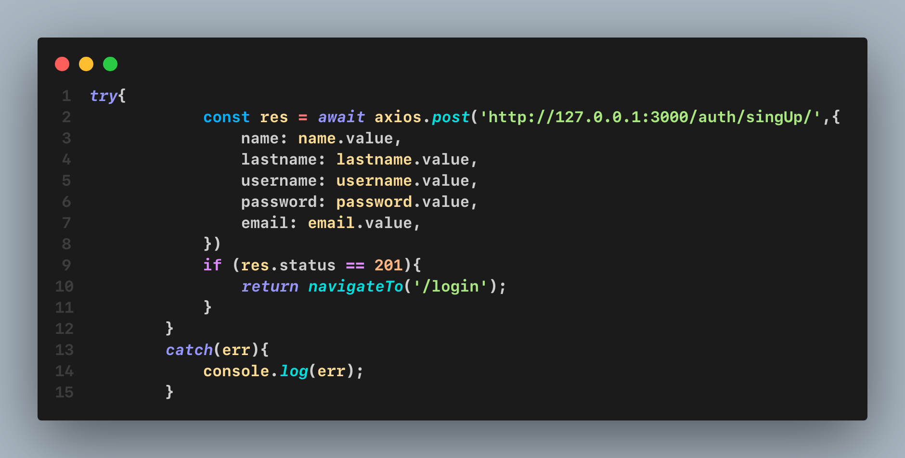
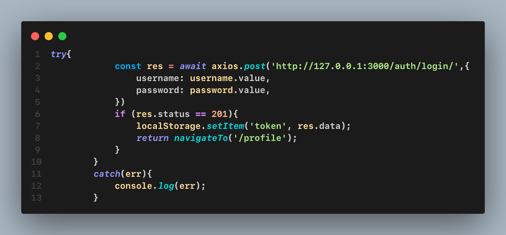
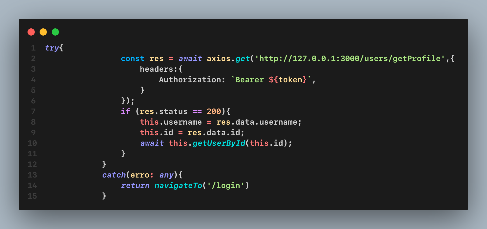
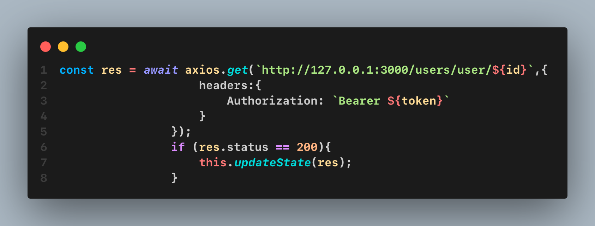

<p align="center">
  <a href="http://nestjs.com/" target="blank"></a>
</p>

[circleci-image]: https://img.shields.io/circleci/build/github/nestjs/nest/master?token=abc123def456
[circleci-url]: https://circleci.com/gh/nestjs/nest

  <p align="center">A progressive <a href="http://nodejs.org" target="_blank">Node.js</a> framework for building efficient and scalable server-side applications.</p>
    <p align="center">
<a href="https://www.npmjs.com/~nestjscore" target="_blank"></a>
<a href="https://www.npmjs.com/~nestjscore" target="_blank"></a>
<a href="https://www.npmjs.com/~nestjscore" target="_blank"></a>
<a href="https://circleci.com/gh/nestjs/nest" target="_blank"></a>
<a href="https://coveralls.io/github/nestjs/nest?branch=master" target="_blank"></a>
<a href="https://discord.gg/G7Qnnhy" target="_blank"></a>
<a href="https://opencollective.com/nest#backer" target="_blank"></a>
<a href="https://opencollective.com/nest#sponsor" target="_blank"></a>
  <a href="https://paypal.me/kamilmysliwiec" target="_blank"></a>
    <a href="https://opencollective.com/nest#sponsor"  target="_blank"></a>
  <a href="https://twitter.com/nestframework" target="_blank"></a>
</p>
  <!--[](https://opencollective.com/nest#backer)
  [](https://opencollective.com/nest#sponsor)-->

## Description

[Nest](https://github.com/nestjs/nest) framework TypeScript starter repository.

## Project setup

```bash
$ npm install
```

## Features

- User Registration
- User Login
- JWT Token Generation
- Token-based Authentication

## Technologies Used

- Nest
- JWT (JSON Web Tokens)
- TypeOrm (Database management)
- Passport (Google Authetication)


## Configuration

### Setting up TypeORM with PostgreSQL

TypeORM is a powerful and flexible ORM that works seamlessly with NestJS. For this project, we're using PostgreSQL as our database. Here's how to set it up:

### 1. Install Required Packages

First, you need to install the required packages:

```bash
$ npm install @nestjs/typeorm typeorm pg
```

You'll need to configure TypeORM to connect to your PostgreSQL database. Typically, this is done in the app.module.ts file

```javascript
  @Module({
  imports: [
    TypeOrmModule.forRoot({
      type: 'postgres',
      host: process.env.DATABASE_HOST || 'localhost',
      port: parseInt(process.env.DATABASE_PORT, 10) || 5432,
      username: process.env.DATABASE_USER || 'your_username',
      password: process.env.DATABASE_PASSWORD || 'your_password',
      database: process.env.DATABASE_NAME || 'your_database',
      entities: [User],
      synchronize: true, // Set to false in production for safety
    }),
    UserModule,
    AuthModule,
  ],
})
export class AppModule {}
```
For security and flexibility, it's a good practice to use environment variables for your database configuration. Create a .env file in the root of your project:

```makefile
DATABASE_HOST=localhost
DATABASE_PORT=5432
DATABASE_USER=your_username
DATABASE_PASSWORD=your_password
DATABASE_NAME=your_database

```

this is already included in the project you will need just to add your env variables
```javascript
import { ConfigModule } from '@nestjs/config';

@Module({
  imports: [
    ConfigModule.forRoot({
      isGlobal: true,
    }),
    TypeOrmModule.forRoot({
      type: 'postgres',
      host: process.env.DATABASE_HOST,
      port: parseInt(process.env.DATABASE_PORT, 10),
      username: process.env.DATABASE_USER,
      password: process.env.DATABASE_PASSWORD,
      database: process.env.DATABASE_NAME,
      entities: [User],
      synchronize: true,
    }),
    // Other modules...
  ],
})
export class AppModule {}
```
## Authentication Endpoints

This project includes several endpoints to handle user authentication. Below is a detailed explanation of each endpoint, including the request format and the expected response.

### 2. **User Registration**

**Endpoint:** `POST <your-host>/auth/singUp`

This endpoint allows a new user to register by providing their details.

exemple : 


**Request:**

```json
{
  "name": "name.value",
  "lastname": "lastname.value",
  "username": "username.value",
  "password": "password.value",
  "email": "email.value",
}
```
**Response:**
```json
{
  "id": "1",
  "name": "name.value",
  "lastname": "lastname.value",
  "username": "username.value",
  "email": "email.value",
  "isActive": false
}
```

### 3. **User Login**

**Endpoint:** `POST <your-host>/auth/login`

This endpoint allows a new user to login by providing their userame and password.

exemple : 


**Request:**

```json
{

  "username": "username.value",
  "password": "password.value"
}
```
**Response:**
```json
{
  "token": "token value must be stored in chosen sotrage for upcoming requests"
}
```

### 3. **Get User Profile**
**Endpoint:** `POST <your-host>/users/getProfile`
exmple : 


**Request:**
headers:{
    Authorization: `Bearer ${token}`,
}

token must be present in header else u will get 401 Unauthroized Expection

{
  "Authorization": "Bearer jwt_token_here"
}
**Response:**
```json
{
  "id": 1,
  "username": "john_doe",
}
```

### 4. **Fetch other user details**
**Endpoint:** `POST <your-host>/users/user/${id}`
exemple :


**Request:**
headers:{
    Authorization: `Bearer ${token}`,
}

token must be present in header else u will get 401 Unauthroized Expection

{
  "Authorization": "Bearer jwt_token_here"
}
**Response:**
```json
{
  "id": 1,
  "username": "john_doe",
  "name": "name",
  "lastname": "lastname",
  "username": "username",
  "isActive": "false",
}
```

### 5. **Google Authentication**

**Endpoint:** `POST <your-host>/auth/google
This endpoint initiates the OAuth2 authentication flow with Google. The user is redirected to Google's consent screen.

### 5. **Google Authentication Callback**
**Endpoint:** `POST <your-host>/auth/google/callback

This endpoint handles the callback after a user has authenticated with Google. It will create or log in the user with the Google account.
in my code i retur a response with redirectio to a test front end with token in the url
```javascript
res.redirect(`http://front-end-hot/front-end-callbakc-page?token=${token}`);
```
you must create your front-end callback page and get token from url
Response:
Success (200 OK): Redirects to the application's dashboard or provides a JWT token.
```json
{
  "accessToken": "jwt_token_here",
  "expiresIn": 3600
}
```

## Compile and run the project

```bash
# development
$ npm run start

# watch mode
$ npm run start:dev

# production mode
$ npm run start:prod
```

## Run tests

```bash
# unit tests
$ npm run test

# e2e tests
$ npm run test:e2e

# test coverage
$ npm run test:cov
```

## Resources

Check out a few resources that may come in handy when working with NestJS:

- Visit the [NestJS Documentation](https://docs.nestjs.com) to learn more about the framework.
- For questions and support, please visit our [Discord channel](https://discord.gg/G7Qnnhy).
- To dive deeper and get more hands-on experience, check out our official video [courses](https://courses.nestjs.com/).
- Visualize your application graph and interact with the NestJS application in real-time using [NestJS Devtools](https://devtools.nestjs.com).
- Need help with your project (part-time to full-time)? Check out our official [enterprise support](https://enterprise.nestjs.com).
- To stay in the loop and get updates, follow us on [X](https://x.com/nestframework) and [LinkedIn](https://linkedin.com/company/nestjs).
- Looking for a job, or have a job to offer? Check out our official [Jobs board](https://jobs.nestjs.com).

## Support

Nest is an MIT-licensed open source project. It can grow thanks to the sponsors and support by the amazing backers. If you'd like to join them, please [read more here](https://docs.nestjs.com/support).

## Stay in touch

- Author - [Kamil Myśliwiec](https://twitter.com/kammysliwiec)
- Website - [https://nestjs.com](https://nestjs.com/)
- Twitter - [@nestframework](https://twitter.com/nestframework)

## License

Nest is [MIT licensed](https://github.com/nestjs/nest/blob/master/LICENSE).
